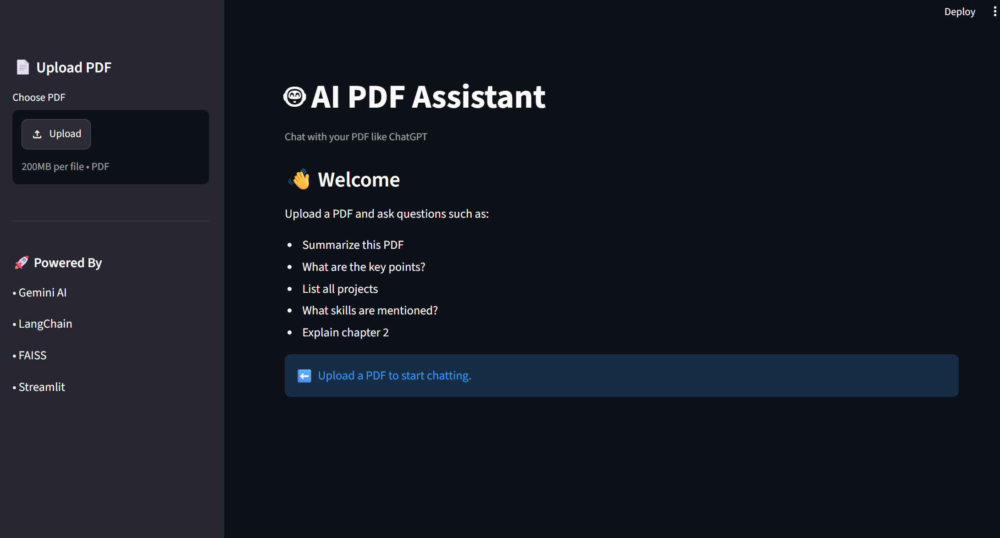
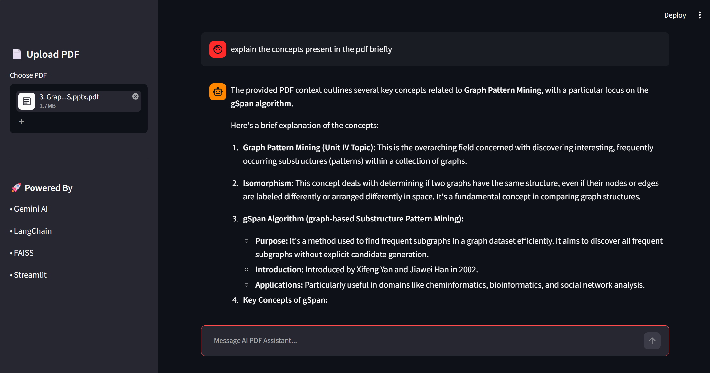

# 🤖 AI PDF Chatbot

An AI-powered PDF Question Answering application built using Gemini AI, LangChain, FAISS, and Streamlit.

Users can upload a PDF document and ask questions in natural language. The chatbot retrieves relevant content from the PDF and generates context-aware answers using Google's Gemini model.

---

## 🚀 Features

- 📄 Upload PDF documents
- 🔍 Extract text from PDFs
- ✂️ Intelligent text chunking
- 🧠 Vector embeddings using Gemini Embeddings
- 📚 FAISS vector database for semantic search
- 🤖 Gemini AI powered answers
- 💬 ChatGPT-like chat interface
- ⚡ Fast and interactive Streamlit UI

---

## 🛠️ Tech Stack

- Python
- Streamlit
- LangChain
- Google Gemini AI
- FAISS
- PyPDF
- dotenv

---

## 📂 Project Structure

```text
AI-PDF-Chatbot/
│
├── app.py
├── pdf_loader.py
├── text_splitter.py
├── vector_store.py
├── requirements.txt
├── .gitignore
├── .env
└── faiss_index/
```

---

## ⚙️ Installation

### Clone Repository

```bash
git clone https://github.com/nithyanarikimilli/AI-PDF-Chatbot.git

cd AI-PDF-Chatbot
```

### Create Virtual Environment

```bash
python -m venv venv
```

### Activate Environment

Windows:

```bash
venv\Scripts\activate
```

Mac/Linux:

```bash
source venv/bin/activate
```

### Install Dependencies

```bash
pip install -r requirements.txt
```

---

## 🔑 Configure Gemini API Key

Create a `.env` file:

```env
GOOGLE_API_KEY=YOUR_GEMINI_API_KEY
```

Get your API key from:

https://aistudio.google.com

---

## ▶️ Run Application

```bash
streamlit run app.py
```

Application will open at:

```text
http://localhost:8501
```

---

## 💡 Example Questions

- Summarize this PDF
- What are the key points?
- List all projects
- What skills are mentioned?
- Explain chapter 2
- Give a detailed summary

---

## 📸 Screenshots

### Home Page



### Chat Example


---

## 🔄 Workflow

1. Upload PDF
2. Extract text
3. Split into chunks
4. Generate embeddings
5. Store vectors in FAISS
6. Retrieve relevant context
7. Generate answer using Gemini AI

---

## 🎯 Future Improvements

- Multiple PDF support
- Chat history export
- PDF highlighting
- Voice input
- User authentication
- Cloud deployment

---

## 👨‍💻 Author

**Narikimilli Hema Nithya**

B.Tech Computer Science Engineering

SASTRA Deemed University

GitHub:
https://github.com/nithyanarikimilli

---

## ⭐ If you like this project

Give it a star on GitHub!